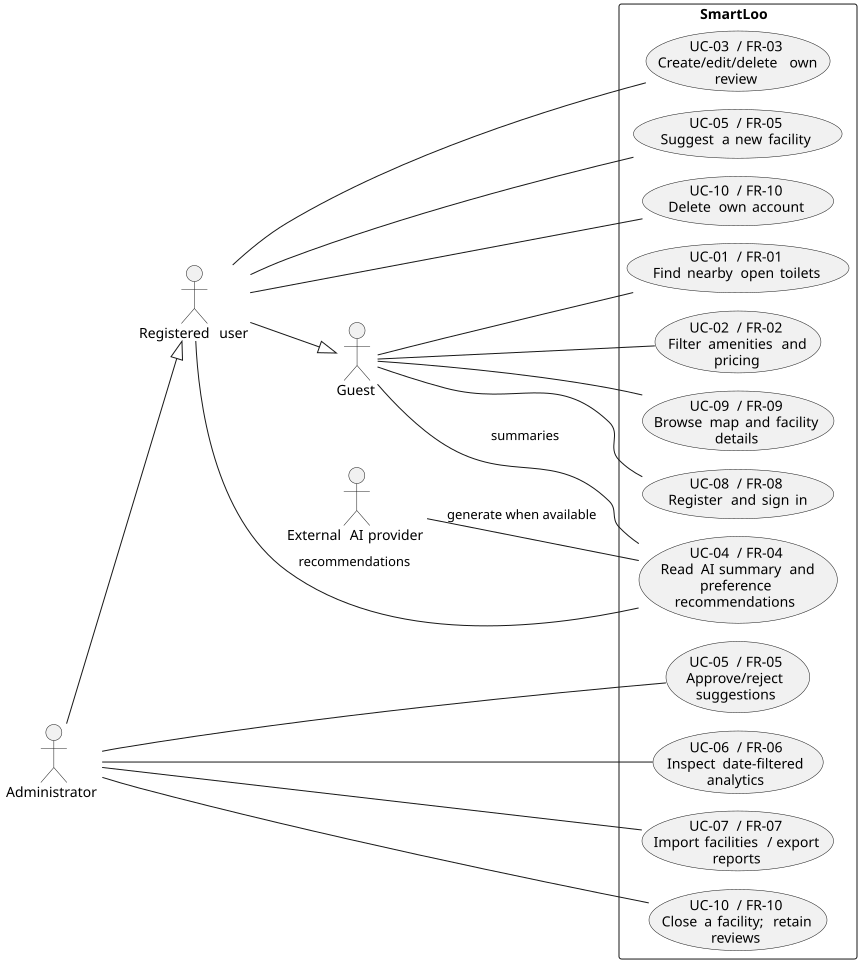

# SmartLoo — Requirements Definition Report

> **Course:** CMPE 331 — Software Engineering Concepts  
> **Version:** 1.2 — TA review corrections, 10 October 2026
> **GitHub review PR deadline:** 08.10.2026 (announcement does not specify an hour)  
> **Final PDF deadline:** 11.10.2026 23:59, following PR approval  
> **Repository:** https://github.com/akcedia/SmartLoo  
> **Team Contact / integration:** Özgür Kılıç

## 1. Purpose, scope and delivery

SmartLoo helps residents and visitors discover public toilets in Istanbul using location, accessibility, amenities and community hygiene feedback. Administrators inspect date-filtered hygiene statistics and import/export data. The delivery is a responsive web application with a service API; a separate native mobile application is not part of this baseline.

Guest users can browse/search/filter and read details. Registered users can submit and manage their own reviews and suggest locations. Administrators moderate suggestions/reviews, view analytics and import/export records. External data providers and the AI service are supporting systems.

The [Charter](CHARTER.MD) defines the technology constraints: FastAPI, PostgreSQL/PostGIS, MongoDB, Redis, JWT, React and Leaflet, with cloud hosting and GitHub workflows. Detailed architecture and E-R models belong to later analysis/design deliverables. JWTs are signed tokens; encryption is not assumed.

Out of scope: cleaning-staff scheduling/payroll, IoT occupancy/supply sensing and payments. Refresh tokens, social login and password reset are excluded from this first authentication baseline. AI recommendations select suitable facilities; turn-by-turn navigation is not specified here.

The instructor's 6 October announcement requires a dedicated branch, planning artifacts, use cases/user stories, committed tests, this Markdown report, a PR with Yeşim as reviewer, and a PDF after approval. This report does not claim that implementation, review approval or non-functional targets have been achieved.

## 2. Contribution sources and integration decisions

Original contributions remain available through the GitHub issue, commit and PR links below; duplicate copies are not included in this submission. This report and [the normalized security specification](requirements/db-security.md) define the integrated review baseline. Decisions below are proposed integration choices for team/TA review, not requirements imposed by the instructor.

| Contributor | Evidence | Integrated coverage |
|---|---|---|
| Özgür Kılıç | [Core commit ab59c968](https://github.com/akcedia/SmartLoo/commit/ab59c968075a3cc702d592570f7165dc05193bb9), [issue #2](https://github.com/akcedia/SmartLoo/issues/2) | Search, filtering, original report and integration |
| Yusuf Selim Aksu | [Issue #3](https://github.com/akcedia/SmartLoo/issues/3), [PR #10](https://github.com/akcedia/SmartLoo/pull/10) | TC-01–TC-10, NFR-T01–03; extended during integration |
| Emir Miraç İslamoğlu | [Issue #4](https://github.com/akcedia/SmartLoo/issues/4) | External-source uncertainty and AI constraints |
| Fırat Karadoğan | [Issue #5 and attached ZIP](https://github.com/akcedia/SmartLoo/issues/5) | REQ-DB-01–06, REQ-SEC-01–07, 19 test specifications |
| Onur Arda Buldağ | [Issue #6](https://github.com/akcedia/SmartLoo/issues/6) | District/time analytics, critical threshold and CSV columns |
| Ahmet Furkan Yardımcı | [Issue #7](https://github.com/akcedia/SmartLoo/issues/7) | Initial map, marker details, filtering and location permissions |

| Difference in sources | Integrated decision |
|---|---|
| FR numbering | Preserve original FR-01–07; append auth FR-08, map FR-09, integrity/privacy FR-10. |
| Test numbering | Preserve Yusuf's TC-01–10. Original draft's TC-01 accessibility becomes TC-02; original nearby TC-02 becomes TC-01. Other draft tests map by behavior, not old number. Normalize all functional IDs to TC-01–TC-48 across report, catalog and Python; database cases use TC-29–TC-36 and security cases TC-37–TC-48. |
| JWT 15 vs 60 minutes | Adopt Fırat's 60-minute signed access token; remove refresh endpoint from this baseline. |
| Review every 24 hours vs one per toilet | One review per user/toilet; user can update or delete it. |
| HTTP 400 vs 422; guest 403 vs 401 | Invalid input 422, missing/invalid authentication 401, authenticated but forbidden 403. |
| Paths and fields differ | Use `/api/v1`, `lon`, `has_disabled_access`, `cleanliness_score`, `average_cleanliness`; nearby returns JSON `results`, not GeoJSON. The verified external source uses GeoJSON; the nearby API uses the normalized JSON results contract. |
| Database integer vs UUID IDs | Production identifiers are UUIDs; small numbers/names in BDD are fixture aliases. |
| Unknown accessibility/pricing | Store/display unknown explicitly; unknown does not match a true/false filter. |
| Same SQL/Mongo transaction | Require consistent observable aggregates before acknowledging success; implementation coordination is deferred to design. |
| AI English/general schema vs Turkish research | Summary text is Turkish. `summary_tr → summary`, `positives → pros`, `negatives → cons`, `review_count → based_on_reviews`. Categories retained; confidence must not be presented as a calibrated probability. |
| Mean vs p95 search latency | Measure both; mean <250 ms and p95 <250 ms under the defined load. These are team targets. |
| Operational logs in dashboard | Preserve export columns; missing cleaning/complaint records are null/blank, never fabricated. This phase does not add a complete work-order system. |

### 2.1 Use case diagram



[Editable PlantUML source](requirements/use-cases.puml). Guest, registered-user and administrator actors are permission roles. Registered users inherit guest browsing; administrators inherit registered-user actions. The AI provider is an external supporting actor. UC-01–UC-10 map to FR-01–FR-10 below; database and authentication sub-rules remain in their detailed specifications. UC-05 groups submission and administrator moderation, with each operation associated with its permitted actor. UC-10 groups self-account deletion and administrator facility closure. No external-provider availability is assumed for ordinary search.

## 3. Functional requirements

| ID | User capability | Priority |
|---|---|---|
| FR-01 | Find nearby open toilets ordered by distance | Must |
| FR-02 | Filter by accessibility, baby changing and price | Must |
| FR-03 | Create, edit and delete hygiene reviews with ownership checks | Must |
| FR-04 | Read grounded Turkish AI summaries and preference recommendations | Must |
| FR-05 | Suggest locations and administer approval/rejection | Should |
| FR-06 | View district/date hygiene analytics and critical alerts | Must |
| FR-07 | Import CSV/JSON and export filtered reports | Should |
| FR-08 | Register, log in and enforce role-based access | Must |
| FR-09 | Browse an interactive map and inspect markers | Must |
| FR-10 | Maintain valid linked data and delete account personal data | Must |

All listed requirements are specified and tested in this baseline; Should denotes delivery priority, not permission to omit their specification.

### 3.1 Feature: Proximity-Based Search (FR-01)

**User Story**
> As a **city resident or tourist**,
> I want to **see the nearest open public toilets within a chosen radius on the map**,
> so that I can **reach one quickly**.

```gherkin
Feature: Proximity-based search for public toilets
  In order to quickly find a nearby facility
  As a user of the SmartLoo web app
  I want to see the nearest open public toilets within a given radius

  Background:
    Given the toilet database contains the following records:
      | id | name                    | latitude  | longitude | is_open_now |
      | 1  | Taksim Square WC        | 41.0369   | 28.9850   | true        |
      | 2  | Istiklal Avenue WC      | 41.0340   | 28.9780   | true        |
      | 3  | Galata Tower WC         | 41.0256   | 28.9742   | false       |
      | 4  | Kadikoy Pier WC         | 40.9910   | 29.0230   | true        |
    And each toilet location is stored as a PostGIS "geography(Point, 4326)"

  Scenario: Locate nearest open toilets within a specified radius
    Given I have granted location access with coordinates "41.0360, 28.9840"
    And I have selected a search radius of 1000 meters
    When I request nearby toilets via "GET /api/v1/toilets/nearby?lat=41.0360&lon=28.9840&radius=1000&open_now=true"
    Then the response status code should be 200
    And the response should contain toilets "Taksim Square WC" and "Istiklal Avenue WC"
    And the response should not contain "Galata Tower WC" because it is closed (the fixture may also be outside the radius; TC-01 separately isolates a closed facility inside the radius)
    And the response should not contain "Kadikoy Pier WC" because it is outside the radius
    And the results should be sorted by "distance_m" in ascending order
    And each result should include "id", "name", "latitude", "longitude" and "distance_m"
    And the Leaflet map should display one marker per returned toilet
    And the map should fit its bounds to the search radius circle

  Scenario: No open toilets found within the radius
    Given I am located at "41.0800, 29.0500"
    And I have selected a search radius of 200 meters
    When I request nearby toilets with "open_now=true"
    Then the response status code should be 200
    And the response body "results" should be an empty list
    And the UI should show the message "No open toilets found nearby. Try increasing the search radius."

  Scenario Outline: Reject invalid search parameters
    When I request nearby toilets with lat "<lat>", lon "<lon>" and radius "<radius>"
    Then the response status code should be 422
    And the error message should mention "<field>"

    Examples:
      | lat   | lon    | radius | field  |
      | 95.0  | 28.98  | 1000   | lat    |
      | 41.03 | 200.0  | 1000   | lon    |
      | 41.03 | 28.98  | -50    | radius |
      | 41.03 | 28.98  | 50001  | radius |
```

**Implementation Notes**
- Spatial query uses `ST_DWithin(location, ST_MakePoint(:lon, :lat)::geography, :radius)` together with `ST_Distance` for ordering. A GIST index on `location` is required.
- `is_open_now` is computed server-side from `opening_hours` in the `Europe/Istanbul` time zone.
- Allowed radius range: 1 m – 50,000 m (default 1,000 m).

---

### 3.2 Feature: Filtering by Accessibility & Amenities (FR-02)

**User Story**
> As a **wheelchair user or a parent with an infant**,
> I want to **filter toilets by accessibility and amenities**,
> so that I **only see facilities I can actually use**.

```gherkin
Feature: Filter toilets by accessibility and amenities
  In order to find a facility that meets my specific needs
  As a user of the SmartLoo web app
  I want to filter search results by accessibility features and pricing

  Background:
    Given the toilet database contains the following records:
      | id | name               | has_disabled_access | has_baby_changing | is_free | price_try |
      | 1  | Taksim Square WC   | true                | true              | false   | 10.00     |
      | 2  | Istiklal Avenue WC | false               | true              | true    | 0.00      |
      | 3  | Sishane Metro WC   | true                | false             | true    | 0.00      |
      | 4  | Cihangir Park WC   | false               | false             | false   | 5.00      |
    And all toilets are within 2000 meters of "41.0340, 28.9800"

  Scenario: Filter by wheelchair accessibility
    Given I am located at "41.0340, 28.9800"
    When I enable the "Wheelchair Accessible" filter
    And the app sends "GET /api/v1/toilets/nearby?lat=41.0340&lon=28.9800&radius=2000&has_disabled_access=true"
    Then the response status code should be 200
    And every toilet in the response should have "has_disabled_access" equal to true
    And the response should contain exactly "Taksim Square WC" and "Sishane Metro WC"
    And the map should show a wheelchair icon on each returned marker

  Scenario: Combine multiple amenity filters
    Given I am located at "41.0340, 28.9800"
    When I enable the "Wheelchair Accessible" filter
    And I enable the "Baby Changing Room" filter
    Then only "Taksim Square WC" should be returned
    And the active filter chips "Wheelchair Accessible" and "Baby Changing Room" should be visible

  Scenario Outline: Filter by pricing status
    Given I am located at "41.0340, 28.9800"
    When I set the pricing filter to "<pricing>"
    Then every toilet in the response should have "is_free" equal to <is_free>
    And the number of results should be <count>

    Examples:
      | pricing | is_free | count |
      | Free    | true    | 2     |
      | Paid    | false   | 2     |

  Scenario: Filters that match no toilets
    Given I am located at "41.0340, 28.9800"
    When I enable the "Baby Changing Room" filter
    And I set the pricing filter to "Free"
    And I enable the "Wheelchair Accessible" filter
    Then the response body "results" should be an empty list
    And the UI should suggest "Remove some filters to see more results."

  Scenario: Clearing filters restores the full result set
    Given I have the "Wheelchair Accessible" filter enabled
    When I click "Clear all filters"
    Then all 4 toilets should be displayed on the map
```

**Implementation Notes**
- Filters are optional boolean query parameters (`has_disabled_access`, `has_baby_changing`, `is_free`) combined with logical **AND**.
- An omitted filter means "no constraint", not `false`.

---

### 3.3 Feature: User Hygiene Rating & Review Submission (FR-03)

**User Story**
> As a **registered user**,
> I want to **rate a toilet's cleanliness and write a short review**,
> so that **other users and municipal managers know its current hygiene status**.

```gherkin
Feature: Submit a hygiene rating and review
  In order to share my experience and improve hygiene transparency
  As an authenticated SmartLoo user
  I want to submit a cleanliness score and written feedback for a toilet

  Background:
    Given a toilet exists with id 1 and name "Taksim Square WC"
    And a registered user "ayse@example.com" exists with role "user"

  Scenario: Authenticated user submits a valid rating and review
    Given I am logged in as "ayse@example.com" with a valid JWT access token
    When I send "POST /api/v1/toilets/1/reviews" with the body:
      """
      {
        "cleanliness_score": 4,
        "comment": "Clean and well-lit, but the soap dispenser was empty.",
        "tags": ["well-lit", "no-soap"]
      }
      """
    Then the response status code should be 201
    And a review document should be stored in the MongoDB "reviews" collection with:
      | field             | value                 |
      | toilet_id         | 1                     |
      | user_id           | <id of ayse>          |
      | cleanliness_score | 4                     |
      | created_at        | <current UTC time>    |
    And the toilet's "average_cleanliness" and "review_count" should be recalculated
    And the cached statistics for toilet 1 should be invalidated in Redis
    And I should see the confirmation "Thank you! Your review has been submitted."

  Scenario: Guest user attempts to submit a review
    Given I am not logged in
    When I send "POST /api/v1/toilets/1/reviews" without an Authorization header
    Then the response status code should be 401
    And no document should be inserted into the "reviews" collection
    And the UI should redirect me to the login page

  Scenario: Expired token is rejected
    Given I am logged in with an expired JWT access token
    When I submit a review for toilet 1
    Then the response status code should be 401
    And the error code should be "token_expired"

  Scenario Outline: Invalid review payload is rejected
    Given I am logged in as "ayse@example.com"
    When I submit a review for toilet 1 with cleanliness_score <score> and comment "<comment>"
    Then the response status code should be 422
    And the error message should mention "<field>"

    Examples:
      | score | comment                    | field             |
      | 0     | Too dirty                  | cleanliness_score |
      | 6     | Perfect                    | cleanliness_score |
      | 3     | <comment of 1001 chars>    | comment           |

  Scenario: Prevent duplicate reviews for the same toilet
    Given I am logged in as "ayse@example.com"
    And I already submitted a review for toilet 1 previously
    When I submit another review for toilet 1
    Then the response status code should be 409
    And the error message should be "You have already reviewed this toilet. Edit your existing review."
```

**Implementation Notes**
- `cleanliness_score`: integer 1–5 (required). `comment`: 0–1000 characters (optional). `tags`: optional array of predefined values.
- Reviews live in MongoDB. Aggregate values (`average_cleanliness`, `review_count`) are denormalized into PostgreSQL for fast filtering and sorting.

---

### 3.4 Feature: AI-Powered Review Summarization & Recommendation (FR-04)

**User Story**
> As a **user planning to visit a toilet**,
> I want to **read a short AI-generated summary of its reviews**,
> so that I can **decide quickly whether to go there without reading every review**.

```gherkin
Feature: AI-powered review summarization and recommendation
  In order to make an informed decision before visiting a facility
  As a SmartLoo user
  I want to see an AI-generated summary of aggregated reviews and a recommendation

  Background:
    Given toilet 1 "Taksim Square WC" has 25 reviews stored in MongoDB
    And the average cleanliness score of toilet 1 is 3.8
    And the AI Pipeline is configured with a valid OpenAI API key

  Scenario: Display an AI summary for a toilet with enough reviews
    Given no valid cached summary exists for toilet 1 in Redis
    When I open the details panel of "Taksim Square WC" on the map
    And the app sends "GET /api/v1/toilets/1/summary"
    Then the backend should send up to the 50 most recent eligible reviews to the AI Pipeline
    And the response status code should be 200
    And the response should contain:
      | field            | constraint                                         |
      | summary          | non-empty Turkish text, at most 400 characters             |
      | pros             | list of 0 to 3 supported short phrases                       |
      | cons             | list of 0 to 3 short phrases                       |
      | recommendation   | one of "recommended", "acceptable", "avoid"        |
      | based_on_reviews | 25                                                 |
      | generated_at     | ISO-8601 timestamp                                 |
    And the summary should be cached in Redis with a TTL of 6 hours
    And the details panel should show the label "AI-generated summary"

  Scenario: Serve cached summary
    Given a valid cached summary exists for toilet 1 in Redis
    When I request "GET /api/v1/toilets/1/summary"
    Then the response should be returned from the cache
    And the OpenAI API should not be called

  Scenario: Regenerate summary after review changes
    Given a cached summary exists for toilet 1
    When its author edits a source review
    Then the cached summary for toilet 1 should be invalidated
    And the next summary request should generate a new summary

  Scenario: Not enough reviews to summarize
    Given toilet 4 "Cihangir Park WC" has only 2 reviews
    When I request "GET /api/v1/toilets/4/summary"
    Then the response status code should be 200
    And the field "summary" should be null
    And the field "message" should be "Not enough reviews to generate a summary (minimum 3)."
    And the OpenAI API should not be called

  Scenario: Graceful degradation when the AI service is unavailable
    Given the OpenAI API returns an error or times out after 10 seconds
    When I request "GET /api/v1/toilets/1/summary"
    Then the response status code should be 200
    And the field "summary" should be null
    And the response should include "average_cleanliness" and "review_count" as a fallback
    And the UI should show "Summary temporarily unavailable."
    And the error should be logged with a correlation id

  Scenario: Personalized recommendation based on user preferences
    Given I am logged in and my saved preferences are "has_disabled_access=true" and "is_free=true"
    And I am located at "41.0340, 28.9800"
    When I request "GET /api/v1/recommendations?lat=41.0340&lon=28.9800"
    Then the response should contain at most 3 toilets that satisfy my preferences
    And each recommended toilet should include a one-sentence "reason" produced by the AI Pipeline
    And the toilets should be ranked using distance, average cleanliness and review sentiment
```

**Implementation Notes**
- Before reviews are sent to the OpenAI API, personally identifiable information (user names, e-mails) is removed.
- The AI response must follow a strict JSON schema (structured output). If schema validation fails, the fallback path is used.
- Reviews are treated as untrusted input to reduce prompt-injection risk: system instructions are kept separate from user content.

---

Additional acceptance rules for FR-01–04:

- Known closed facilities are excluded when `open_now=true`; unknown opening hours are shown as unknown and excluded from open-only results. Opening status uses Europe/Istanbul. Search distances are geographic distances, not walking-route estimates. The open-only scenario explicitly sends `open_now=true`; amenity-only test requests explicitly send `open_now=false` to isolate filtering from opening status.
- Authenticated users may edit/delete their own reviews; another user's attempt returns 403. Administrators may delete reviews. Aggregates and cached summaries must reflect edits/deletions before stale summaries are served.
- AI categories cover cleanliness, odor, supplies, accessibility and safety; missing evidence is unknown and contradictory evidence is disclosed. Reviews are untrusted data. Summaries must not invent inspections or certify safety. Unknown/unsupported model output triggers the fallback.
- Personalized recommendations accept current request preferences; saving preferences is optional. Distance, average cleanliness and review sentiment guide ranking after hard amenity filters. If AI is unavailable, suitable facilities remain visible without an AI reason.

### 3.5 FR-05 — New location suggestion

As a registered user, I want to suggest a missing toilet so that the map becomes more complete. As an administrator, I want to approve or reject suggestions so that unverified locations are not immediately published.

```gherkin
Feature: Suggest and moderate locations
  Scenario: Submit a valid location
    Given I am authenticated and provide a name, district and valid coordinates
    When I submit a new location suggestion
    Then the response is 202 and includes a suggestion identifier and pending status
    And the facility is not visible in public results
  Scenario: Decide a suggestion
    Given an administrator has two pending suggestions P and Q
    When P is approved and Q is rejected
    Then P becomes visible in search and on the map
    And Q remains absent from public results
  Scenario: Reject invalid or unauthorized submission
    Given a request to suggest or moderate a location
    When authentication is absent, role permission is missing, or coordinates are invalid
    Then the applicable response is 401, 403, or 422 respectively
    And no invalid public facility is created
```

### 3.6 FR-06 — Administrator analytics

As a field/cleaning supervisor, I want district and date-filtered hygiene metrics so that I can identify facilities requiring attention. The default period is the last 30 calendar days; last 7 days and a custom date interval are available. Dates are inclusive in Europe/Istanbul (implemented as a half-open timestamp interval ending at the following midnight). District and date filters affect the KPI, table and trend chart together.

The average is the arithmetic mean of eligible review scores in the selected interval, not an unweighted mean of facility averages. No reviews means null and “No data”, not zero. A score strictly below 3.5 shows a red alert plus the text “Acil Müdahale Gerekli”. The threshold is Onur's proposed team choice. An active facility ratio uses administrative ACTIVE status, not real-time occupancy; if status data is unavailable show “Unknown”.

```gherkin
Feature: District hygiene dashboard
  Scenario: Apply district and date filters
    Given an authenticated administrator and Kadıköy reviews rated 4 and 2 within the interval
    And other reviews exist outside that interval or in another district
    When the administrator selects Kadıköy and the interval
    Then the KPI is 3.0 based on 2 reviews
    And the chart and table use the same selection
    And a critical hygiene alert is displayed
  Scenario: Empty dashboard selection
    Given no reviews match the selected district and dates
    When the administrator loads the dashboard
    Then the review count is 0 and the average is null
    And a no-data message replaces an invented score
```

### 3.7 FR-07 — Data import and report export

As an administrator, I want to import CSV/JSON facility data and export filtered analysis so that I can maintain the dataset and use reports outside SmartLoo.

Imports validate required name, district, coordinates and supplied metadata; the batch is rejected atomically with row errors if any row is invalid. Matching `(source, source_id)` updates existing records; İBB records retain `ibb_source_id`. The result reports inserted, updated and rejected counts. Importing the same source records twice must not create duplicates. Synthetic source IDs in tests are fixtures; the verified facility GeoJSON has no explicit stable ID, so its ingestion identity policy must be established before production imports.

Exports reuse the active district/date filters. CSV uses UTF-8 with BOM, `text/csv; charset=utf-8`, RFC 4180-style quoting and a download filename. Columns: `facility_id,district,hygiene_score,open_issues_count,last_cleaned_at`. JSON uses the same row meanings and `application/json`. `hygiene_score` is the selected-period facility review average. Missing operational records are blank in CSV and null in JSON. Imported administrative fields may populate these columns; they are not inferred from AI reviews.

```gherkin
Feature: Import and export
  Scenario: Repeat a valid import
    Given a valid source record IBB-42 in CSV or JSON
    When an administrator imports it twice
    Then exactly one facility with that source identity exists
    And import counts distinguish inserts from updates
  Scenario: Reject an invalid batch
    Given a batch with one valid record and one latitude of 95
    When the administrator imports the batch
    Then the response is 422 with row errors and neither row changes stored data
  Scenario: Export the current selection
    Given an administrator has filtered the report to Kadıköy
    When CSV or JSON export is selected
    Then the response is 200 with the requested content type
    And only selected rows are exported with the required columns
```

### 3.8 FR-08 — Authentication and authorization

As a visitor, I want to register and log in securely so that I can contribute reviews. As an administrator, I want privileged operations restricted to administrators.

The integrated [security specification](requirements/db-security.md) contains US-SEC-01–04, REQ-SEC-01–07 and TC-37–TC-48. Passwords require 8 or more characters, a letter and a digit; hash with bcrypt cost ≥10 or Argon2. Valid registration returns 201, duplicate case-insensitive email 409 and invalid fields 422. Successful login returns a signed JWT with `sub,role,iat,exp`, token type Bearer and `expires_in=3600`. Wrong credentials return a generic 401. Missing, expired or tampered tokens return 401; a valid USER on an ADMIN operation returns 403. After five failed logins for one email within 15 minutes, subsequent attempts return 429 until expiry. Password hashes never appear in responses. Secrets remain server-side.

Authentication user stories, BDD examples and test specifications are in [db-security.md](requirements/db-security.md). Public registration always assigns USER; supplying ADMIN must not escalate privilege.

### 3.9 FR-09 — End-user map

### End-User UI Workflow & Map Interaction Scenarios

#### User Story
As a city resident or tourist,  
I want to view public toilets on an interactive map and inspect their details by clicking map markers,  
so that I can quickly decide which nearby toilet is suitable for me.

```gherkin
Feature: End-user map interaction

  Scenario: Display the interactive toilet map when the user opens the application
    Given I open the SmartLoo web application
    When the main page finishes loading
    Then I should see an interactive Leaflet map
    And the map should display available public toilet locations as markers
    And I should see controls for location, search radius and available filters

  Scenario: Show toilet details when a map marker is selected
    Given public toilet markers are visible on the map
    When I click on a toilet marker
    Then a details panel or popup should be displayed
    And the selected toilet's name should be visible
    And its distance from the user should be visible when user location is available
    And its accessibility information should be visible
    And its baby-changing availability should be visible
    And its free or paid status should be visible
    And its current hygiene rating should be visible when rating data exists

  Scenario: Close the selected toilet details
    Given a toilet details panel or popup is open
    When I close the panel or select another location on the map
    Then the previously selected toilet details should no longer be displayed

  Scenario: Update map markers after applying filters
    Given multiple toilet markers are displayed on the map
    When I enable one or more available filters
    Then the map should display only the toilet markers matching the active filters
    And the active filters should remain visible to the user

  Scenario: Handle user location permission
    Given I open the SmartLoo application
    When the browser asks for location permission
    And I grant permission
    Then my current location should be used as the center point for nearby toilet search
    And the map should visually indicate my current location

  Scenario: Continue without location permission
    Given the browser asks for location permission
    When I deny location permission
    Then the application should remain usable
    And the map should still be displayed
    And I should be able to browse toilet locations manually
    And the application should inform me that location-based distance results require location permission

  Scenario: Responsive map interaction
    Given I use the SmartLoo web application on a supported screen size
    When I pan or zoom the map
    Then the map should remain interactive
    And visible toilet markers should update consistently with the current map view 

```

Acceptance Criteria
- The end-user interface must provide an interactive map as the primary toilet discovery interface.
- Toilet locations must be represented with clickable map markers.
- Selecting a marker must display relevant toilet information without requiring the user to leave the map page.
- Map results must remain consistent with active search and filter settings.
- Denying browser location permission must not prevent the user from manually browsing the map.
- The interface must remain usable on different supported screen sizes.


### 3.10 FR-10 — Data integrity and account deletion

As a map user, I want valid facility metadata so that search is reliable. As a registered user, I want account deletion to remove my personal account data and anonymize retained feedback.

The normalized [data specification](requirements/db-security.md) defines REQ-DB-01–06 and US-DB-01–03. Reviews must reference existing users and toilets; invalid coordinates return 422, nonexistent toilet references 404. Reviewed toilets are marked CLOSED rather than hard-deleted. On account deletion, remove email, display name and password hash; retain reviews with null user ID and “Anonymous” attribution. Free-text personal data requires removal/redaction as part of deletion; clearing the foreign key alone is insufficient. This is a product privacy requirement, not a claim of legal certification.

Data-integrity user stories, BDD examples and test specifications are in [db-security.md](requirements/db-security.md).

## 4. Non-functional requirements and verification

All numeric values are proposed team acceptance targets. None is an observed production result. NFR tests below are specified, not yet executed against a deployed system.

| ID | Requirement and measurable target | Verification |
|---|---|---|
| NFR-01 | Nearby search: mean and p95 <250 ms with 10,000 records and 50 concurrent clients | NFR-T01 |
| NFR-02 | Cache-hit summary p95 <100 ms; healthy uncached generation target <8 s; timeout fallback by 10 s | NFR-T04 |
| NFR-03 | Password hashing, 60-minute JWT, roles and login throttling per FR-08 | NFR-T02; TC-37–TC-48 |
| NFR-04 | Production HTTPS; validate inputs, render comments as text; no secret/hash exposure | NFR-T03, NFR-T07 |
| NFR-05 | Usable layouts at 360, 768 and 1920 px; initial map target <2 s under a recorded mobile network profile; ≥30 FPS with 500 visible markers | NFR-T05 |
| NFR-06 | Keyboard access to search, filters and details; visible focus, labels and WCAG 2.1 AA target | NFR-T05; automated score alone is not conformance proof |
| NFR-07 | 99% monthly public API availability target; AI outage must not disable search | NFR-T06 |
| NFR-08 | No persistent user location without explicit consent; remove account personal data and redact PII before AI | NFR-T07; TC-34 |
| NFR-09 | Backend automated coverage target ≥80% during implementation; lint/test/build gate before implementation merges | NFR-T08 |
| NFR-10 | Turkish and English interface labels; AI summary text Turkish in this baseline | NFR-T09 |

| Test ID | Setup and procedure | Acceptance / evidence |
|---|---|---|
| NFR-T01 | Staging with 10,000 synthetic facilities, record host and DB configuration; warm for 1 minute, run mixed nearby/filter requests with 50 clients for 5 minutes | Mean and p95 each <250 ms; zero unexpected non-2xx responses; retain load report. Exclude external AI and tile traffic. |
| NFR-T02 | Exercise protected write/admin endpoints with absent, expired, tampered, USER and ADMIN tokens | First three 401; USER admin access 403; ADMIN succeeds. No unauthorized writes. |
| NFR-T03 | Submit latitude 95, longitude 200, radius -50 and 50001, rating 0/6 and comment length 1001 | Each returns 422 naming invalid input; stored state unchanged. This is a validation/security check, also functional. |
| NFR-T04 | Record 100 cache-hit requests and 20 healthy uncached requests; separately force provider timeout | Cache p95 <100 ms; uncached p95 <8 s; timeout fallback by 10 s. Record environment and provider/mock separately. |
| NFR-T05 | Test three viewport widths; keyboard-only map alternatives/details; axe/Lighthouse plus manual focus/contrast checks; 500-marker pan/zoom | No horizontal overflow blocking actions; labels/focus usable; ≥30 FPS; Lighthouse accessibility ≥90; no serious/critical axe findings. Record throttling/hardware. |
| NFR-T06 | Disable AI then perform search/filter/details; monitor public API each minute for a calendar month | Core requests continue; AI unavailable message appears. Availability ≥99% measured separately; short tests do not prove monthly uptime. |
| NFR-T07 | Seed synthetic email/name/phone in reviews; capture AI request; deny location permission; delete account; inspect public responses and storage | PII absent from AI request; no unconsented stored location; account identifiers removed and review text redacted where needed; hashes/secrets absent from responses. |
| NFR-T08 | Run implementation lint, tests, build and branch coverage report | All implementation checks pass and backend coverage ≥80%. Requirements red tests are evidence of pending implementation, not a passing implementation gate. |
| NFR-T09 | Switch UI between Turkish and English across map, auth, errors and dashboard | Labels/messages switch without losing filters; Turkish AI text remains explicitly identified. |

## 5. Functional test specifications and current execution status

The [case catalog](../tests/requirements_cases.json) retains 48 acceptance specifications with requirement IDs, preconditions, actions and expected outcomes. Each entry identifies its automated function or manual UI procedure. [test_requirements.py](../tests/test_requirements.py) contains direct, readable HTTP tests, rather than a generic interpreter of expected results. The JSON is a specification catalog, not executable input. Fixture names A–D map to UUIDs in the Python tests; the executable fixtures determine actual coordinate/filter values. Named-city BDD examples in section 3 illustrate the same rules with different input data; they are not the A–D HTTP fixtures. Each catalog case and the acceptance table below use the executable fixture values. Labels, factual support of generated text and complete browser behavior still require the specified manual/NFR checks.

The suite uses FastAPI TestClient against [src/app.py](../src/app.py). The application registers the intended routes and currently returns HTTP 501 for unimplemented features. Tests send actual in-process HTTP requests and assert the required status, response content, stored state, token signature or mocked provider calls. They never substitute fake successful responses. A fresh in-memory repository and deterministic AI mock are supplied for each test. These are test doubles, not PostgreSQL/MongoDB integration. JWTs are genuinely signed with a public test-only key, and password fixtures use bcrypt. No paid AI calls or external database services are used.

**Verified red-stage run, 10 October 2026: 52 collected, 52 failed, 0 errors, 0 skipped; exit code 1.** This consists of 46 automated catalog cases (including a limited initial-page test and TC-48 registration-role protection) plus six parameterized variants. TC-22/23 are manual UI specifications, not counted as executed tests. All current failures are HTTP 501 mismatches against the required behavior. Assertions after the first failed assertion are present but are not yet reached; application correctness is not established by this run.

From the repository root, using Python 3.12:

```sh
python -m pip install -r requirements-test.txt
python -m pytest tests/test_requirements.py -q
```

Expected current exit code: 1. Implement the route behaviors incrementally until tests pass. Preserve behavioral assertions; replace the test repository with production adapters during later integration work. The pinned dependency file records the versions used for the verified run. TestClient setup follows the [official FastAPI testing documentation](https://fastapi.tiangolo.com/tutorial/testing/).

The table below retains the acceptance outcomes; some combined API/UI outcomes also require the manual checks in section 5.1. Every automated TC-NN maps to `test_tc_NN`; TC-22/23 are manual procedures.

| Test | Requirement | Behavior | Expected result |
|---|---|---|---|
| TC-01 | FR-01 | Nearby open toilets | ids=["A", "B"]; distance_m_approx=[111, 444]; absolute_tolerance_m=[3, 5]; http_status=200 |
| TC-02 | FR-02 | Accessibility filter | ids_unordered=["A", "C"]; http_status=200 |
| TC-03 | FR-02 | Baby changing filter | ids_unordered=["A", "B"]; http_status=200 |
| TC-04 | FR-08 | Successful login | token_signature_valid=true; expires_in=3600; claims_present=["sub", "role", "iat", "exp"]; http_status=200 |
| TC-05 | FR-03 | Reject guest review | review_count=0; http_status=401 |
| TC-06 | FR-03 | Create review and aggregate | average_cleanliness=3.0; review_count=3; stored_score=3; http_status=201 |
| TC-07 | FR-05 | Suggest location | http_status=202; status="pending"; stored_in_suggestions=true; publicly_visible=false |
| TC-08 | FR-04 | Structured Turkish AI summary | http_status=200; summary="Temiz, ancak sabun eksik."; based_on_reviews=3; maximum_summary_length=400; recommendation_in=["recommended", "acceptable", "avoid"]; odor_category="unknown"; provider_calls=1 |
| TC-09 | FR-06 | Filtered dashboard | average_cleanliness=3.0; review_count=2; critical_alert=true; http_status=200 |
| TC-10 | FR-07 | CSV report export | http_status=200; content_type="text/csv; charset=utf-8"; utf8_bom=true; columns=["facility_id", "district", "hygiene_score", "open_issues_count", "last_cleaned_at"]; results_nonempty=true; all_rows_district="Kadıköy" |
| TC-11 | FR-01 | Reject invalid search | http_status=422; variants=[{"lat": 95}, {"lon": 200}, {"radius": -50}, {"radius": 50001}] |
| TC-12 | FR-02 | Combined filters and clearing | filtered_ids=["A"]; cleared_ids=["A", "B", "C"] |
| TC-13 | FR-02 | Pricing filter | ids_unordered=["B", "C"] |
| TC-14 | FR-01 | Empty nearby results | http_status=200; results=[] |
| TC-15 | FR-04 | AI outage and insufficient reviews | http_status=200; summary=null; timeout_review_count=3; provider_calls_for_two_reviews=0; search_http_status=200 |
| TC-16 | FR-04 | Summary cache | provider_calls_after_two_reads=1; provider_calls_after_edit_and_read=2 |
| TC-17 | FR-04 | Preference recommendations | http_status=200; ids=["A"]; has_disabled_access=true; is_free=true; nonempty_reason=true; maximum_results=3 |
| TC-18 | FR-05 | Moderate suggestions | http_status=200; public_facility_ids=["A"]; rejected_facility_B_visible=false |
| TC-19 | FR-07 | Idempotent CSV and JSON import | http_status=200; first_inserted=1; second_inserted=0; second_updated=1; records_with_source_id=1; formats=["csv", "json"] |
| TC-20 | FR-07 | Invalid import is atomic | http_status=422; existing_count=4; state_unchanged=true; row_errors_present=true |
| TC-21 | FR-09 | Initial map HTML and manual marker details | http_status=200; content_type_contains="text/html"; element_ids=["map", "location-control", "search-radius", "filters"]; manual_marker_details_check="section 5.1" |
| TC-22 | FR-09 | Map without geolocation | map_usable=true; permission_message_visible=true; fabricated_distance=false |
| TC-23 | FR-09 | Filter markers remain consistent | marker_ids=["A"]; active_filter_visible=true |
| TC-24 | FR-07 | JSON report export | all_exported_rows_district="Kadıköy"; results_nonempty=true; http_status=200 |
| TC-25 | FR-06 | Dashboard has no data | http_status=200; average_cleanliness=null; review_count=0 |
| TC-26 | FR-03 | Edit and delete own review | edit_status=200; after_edit_average=3.5; delete_status=204; after_delete_average=2.0; after_delete_count=1 |
| TC-27 | FR-10 | Close reviewed facility | reviews=2; hard_deleted=false; facility_status="CLOSED"; http_status=200 |
| TC-28 | FR-04 | Untrusted review content | http_status=200; summary=null; review_count=3; provider_calls=1; email_absent_from_provider_arguments=true |
| TC-29 | FR-10 | Invalid toilet coordinates | saved=false; http_status=422 |
| TC-30 | FR-08 | Case insensitive email | http_status=409 |
| TC-31 | FR-03 | Invalid review rating | saved=false; http_status=422 |
| TC-32 | FR-03 | Duplicate review | review_count=1; http_status=409 |
| TC-33 | FR-10 | Nonexistent toilet | saved=false; http_status=404 |
| TC-34 | FR-10 | Account deletion | reviews=2; user_id=null; author="Anonymous"; http_status=204; user_record_removed=true |
| TC-35 | FR-03 | Recalculate aggregate | average_cleanliness=3.0; review_count=3 |
| TC-36 | FR-07 | Stable source identity | records_with_source_id=1 |
| TC-37 | FR-08 | Weak password | saved=false; http_status=422 |
| TC-38 | FR-08 | Password storage and response | password_hash_valid=true; password_hash_exposed=false; plaintext_stored=false; http_status=201 |
| TC-39 | FR-08 | JWT claims | token_type="Bearer"; expires_in=3600; signature_valid=true; http_status=200 |
| TC-40 | FR-08 | Generic login error | messages=["Invalid email or password", "Invalid email or password"]; http_statuses=[401, 401] |
| TC-41 | FR-08 | Missing token | saved=false; http_status=401 |
| TC-42 | FR-08 | Tampered token | http_status=401; saved=false |
| TC-43 | FR-08 | Expired token | saved=false; http_status=401 |
| TC-44 | FR-08 | User cannot access admin | http_status=403 |
| TC-45 | FR-08 | Admin access | http_status=200 |
| TC-46 | FR-03 | Review ownership | review_retained=true; http_status=403 |
| TC-47 | FR-08 | Login throttling | http_statuses=[401, 401, 401, 401, 401, 429] |
| TC-48 | FR-08 | Public registration cannot grant administrator privileges | http_status_in=[201, 422]; registered_admin=false |

### 5.1 Manual map interaction specifications

These procedures are defined now and will be run once the React/Leaflet interface exists. Status: **Not run — frontend not implemented**. TC-21's automated HTTP test checks only the initial HTML contract (`map`, `location-control`, `search-radius`, `filters` IDs are proposed test hooks), not JavaScript behavior.

| Case | Setup | Steps | Expected result |
|---|---|---|---|
| TC-21 UI | Facilities A/B loaded; browser location granted; page open | Select A's marker; inspect details; close panel; select B | Correct name, distance, accessibility, baby-changing, pricing and available hygiene shown; close removes A's panel; selecting B replaces it; location indicator visible. |
| TC-22 | Reset browser permissions; facilities loaded | Open page; deny geolocation; pan and zoom | Map and markers remain usable; permission explanation visible; no fabricated user distance; no crash. |
| TC-23 | Facilities A/B where only A matches accessibility | Enable accessibility filter; pan/zoom; clear filter | Only matching markers within the current query/view remain; active filter visible; clearing restores eligible results. |

### 5.2 User-story and detailed-specification coverage

Each main story in sections 3.1–3.10 has at least one executable functional test through its FR mapping in section 7. The two FR-05 roles are covered separately: suggestion TC-07 and administrator decision TC-18; import/export roles under FR-07 are covered by TC-19 and TC-10/24. Additional DB/security stories are mapped below. Detailed REQ-DB-01–06 and REQ-SEC-01–07 each retain their executable TC mapping in db-security.md. This is requirement/story coverage, not a claim that every BDD sentence has already been automated.

| Additional story | Executable tests |
|---|---|
| US-DB-01 Valid facility metadata | TC-29, TC-01, TC-02 |
| US-DB-02 Reliable single review and aggregates | TC-31, TC-32, TC-35 |
| US-DB-03 Account deletion | TC-34 |
| US-SEC-01 Registration | TC-37, TC-38, TC-30 |
| US-SEC-02 Login and authenticated actions | TC-39–TC-43, TC-47 |
| US-SEC-03 Administrator access | TC-44, TC-45 |
| US-SEC-04 Review ownership | TC-46, TC-26 |

Catalog case TC-48 (`test_tc_48`) verifies that public registration cannot create an ADMIN account. TC-38 currently selects the permitted bcrypt option. Test repository field names are scaffolding choices and do not replace the later database design.

## 6. API and external interfaces

Canonical paths for integration (detailed schemas remain a design deliverable):

| Method | Path | Access / response |
|---|---|---|
| GET | `/api/v1/toilets/nearby` | Public; lat, lon, radius and optional filters; 200 JSON `{count,results}` |
| GET | `/api/v1/toilets/{id}` | Public; facility details; 404 unknown ID |
| GET / POST | `/api/v1/toilets/{id}/reviews` | Public read; USER write, 201 |
| PATCH / DELETE | `/api/v1/reviews/{id}` | Owner update/delete; ADMIN delete; 200 / 204 |
| GET | `/api/v1/toilets/{id}/summary` | Public; 200 summary or explicit fallback |
| GET | `/api/v1/recommendations` | USER; lat, lon and current preferences; at most three |
| POST | `/api/v1/toilets/suggest` | USER; 202 pending suggestion |
| PATCH | `/api/v1/admin/suggestions/{id}` | ADMIN; approve/reject, 200 |
| PATCH | `/api/v1/admin/toilets/{id}` | ADMIN; change facility status, 200 |
| POST | `/api/v1/auth/register` | Public; 201 |
| POST | `/api/v1/auth/login` | Public; 200 signed JWT |
| DELETE | `/api/v1/users/me` | USER; account deletion, 204 |
| GET | `/api/v1/admin/metrics/summary` | ADMIN; district, from, to; 200 |
| POST | `/api/v1/admin/import` | ADMIN; CSV/JSON, 200 import counts |
| GET | `/api/v1/admin/analytics/export` | ADMIN; format, district, from, to; 200 |

External data verification update, 8 October 2026: after Emir's original research comment, the team supplied two concrete dataset links. CKAN metadata for both datasets and the facility GeoJSON download were successfully retrieved.

| Source | Verified contents and access | Planned use |
|---|---|---|
| [Şehir Tuvaletleri Veri Seti](https://data.ibb.gov.tr/dataset/sehir-tuvaletleri-veri-seti) | 422 GeoJSON point features; resource `9585ab4a-d160-4541-8a41-b86eeec4c1cc`; DataStore disabled; metadata last-modified 2025-06-05 | Initial facility locations and available metadata |
| [Şehir Tuvaletleri Kullanım İstatistikleri](https://data.ibb.gov.tr/dataset/sehir-tuvaletleri-kullanim-istatistikleri) | Metadata describes passage counts by line/station, age and gender; XLSX resources named 2020–2021, 2022–2023 and 2024–2025; DataStore enabled | Candidate historical usage analytics; not a hygiene score or live occupancy feed |

Facility properties are `MAHAL_ADI`, `ILCE`, `TUVALET_DURUM`, `TUVALET_TIP`, `BAKIM_ODASI`, `HIZMET_YERI`, `X`, `Y`. GeoJSON point coordinates use longitude then latitude. Map `MAHAL_ADI` to name and `ILCE` to district; retain original status/type/service-place fields. `Aktif` is administrative status, not evidence of current opening hours. The meaning of `BAKIM_ODASI` must be confirmed before mapping it to baby-changing availability. Wheelchair access, fees, opening hours, review scores and a stable facility identifier are not supplied as explicit fields in the inspected GeoJSON schema; absent values remain unknown. Do not invent an `ibb_source_id`: define a documented source-derived identity or obtain a stable provider ID before production upserts.

The portal labels the facility dataset with the Istanbul Metropolitan Municipality Open Data License; its actual terms and attribution requirements still need review before redistribution. Statistics resource availability is verified through metadata; their rows, exact date coverage and join keys to map facilities have not yet been inspected. Historical usage analytics is optional enrichment, not a new mandatory deliverable. FR-07 remains CSV/JSON batch import; the external-source ingestion adapter must additionally normalize the verified GeoJSON format. Synthetic fixtures remain the basis of reproducible tests. OpenStreetMap is an optional supplement rather than the only fallback for an unlocated İBB dataset.

Leaflet uses a compatible map-tile provider; provider selection and terms remain an analysis task. The OpenAI integration uses server-side credentials, redaction, structured output validation, timeouts and deterministic mocks in tests. No production API request is needed for this submission.

## 7. Traceability and artifacts

| Requirement | Specification | Tests |
|---|---|---|
| FR-01 | Section 3.1 | TC-01, TC-11, TC-14 |
| FR-02 | Section 3.2 | TC-02, TC-03, TC-12, TC-13 |
| FR-03 | Section 3.3 | TC-05, TC-06, TC-31, TC-32, TC-35, TC-46, TC-26 |
| FR-04 | Section 3.4 | TC-08, TC-15, TC-16, TC-17, TC-28 |
| FR-05 | Section 3.5 | TC-07, TC-18 |
| FR-06 | Section 3.6 | TC-09, TC-25 |
| FR-07 | Section 3.7 | TC-10, TC-19, TC-20, TC-24, TC-36 |
| FR-08 | Section 3.8 | TC-48, TC-04, TC-30, TC-37, TC-38, TC-39, TC-40, TC-41, TC-42, TC-43, TC-44, TC-45, TC-47 |
| FR-09 | Section 3.9 | TC-21, TC-22, TC-23 |
| FR-10 | Section 3.10 | TC-29, TC-33, TC-34, TC-27 |

REQ-DB and REQ-SEC mappings to their original user stories and TS tests are retained in the normalized security document. Non-functional mappings are in section 4. Original contributions are referenced by the GitHub links in section 2.

Planning artifacts: [Charter](CHARTER.MD), [WBS](planning/WBS.md), [PERT](planning/PERT.md), [Gantt](planning/GANTT.md) and [delivery plan](requirements/DELIVERY_PLAN.md). The schedule is derived from the Charter milestones; estimated durations are team planning assumptions. Requirement definitions: this report plus [security/data requirements](requirements/db-security.md). Tests: [runner](../tests/test_requirements.py), [case data](../tests/requirements_cases.json).

### 7.1 Submission file guide

The files below organize the deliverable types requested in the instructor's submission announcement. These exact filenames and this particular split are team choices, not individually mandated files. The report is the entry point for review. Repository paths are rooted directly at `docs/`, `tests/` and `src/`, with `requirements-test.txt` at the repository root. The previous nested `SmartLoo-requirements-review/` upload directory and its duplicate Charter have been removed; the existing `docs/CHARTER.MD` is unchanged.

| File | Purpose and reason for inclusion | Delivery role |
|---|---|---|
| [CHARTER.MD](CHARTER.MD) | Existing project purpose, scope, roles and technology constraints against which requirements can be reviewed. Retained unchanged; not a new charter submission. | Project context / planning reference |
| [REQUIREMENTS.MD](REQUIREMENTS.MD) | Main report combining user stories, BDD scenarios, acceptance rules, non-functional requirements, test specifications and traceability. | Requirements specification report |
| [WBS.md](planning/WBS.md) | Deliverable-based decomposition, owners and Charter milestone links. | Work breakdown structure |
| [PERT.md](planning/PERT.md) | Estimated activity durations, dependencies, critical path and schedule slack. | PERT planning analysis |
| [GANTT.md](planning/GANTT.md) | Calendar schedule and fixed Charter deadlines. | Gantt schedule |
| [use-cases.svg](requirements/use-cases.svg) / [source](requirements/use-cases.puml) | UML actors, system boundary and use cases traced to FR-01–FR-10; editable diagram source. | Use case diagram |
| [DELIVERY_PLAN.md](requirements/DELIVERY_PLAN.md) | Records responsibilities, delivery steps and integration risks; complements the WBS, PERT and Gantt. It does not replace them. | Supporting planning document |
| [db-security.md](requirements/db-security.md) | Detailed data-integrity and authentication requirements, user stories and test specifications contributed by the DB/security owner. Kept separate for readability and referenced by the main report. | Supporting requirement definitions |
| [requirements_cases.json](../tests/requirements_cases.json) | Structured acceptance cases containing requirement IDs, illustrative fixture preconditions, actions and expected observations. Includes automated-function/manual-procedure mappings. The Python tests define executable fixture details. | Functional test specification catalog |
| [test_requirements.py](../tests/test_requirements.py) | Sends actual FastAPI TestClient requests and checks HTTP responses, state, signed tokens and AI calls using isolated fixtures. | Executable functional tests |
| [app.py](../src/app.py) | Minimal FastAPI app with explicit feature routes returning HTTP 501 until implementation. Provides isolated repository, JWT-key and AI-provider injection points. | Optional src boilerplate permitted by the announcement |
| [requirements-test.txt](../requirements-test.txt) | Pins the Python packages used to install and reproduce the test run. Contains package names/versions, not bundled libraries. | Reproducible test environment |

Non-functional test procedures are included in section 4; they do not require separate files in this package. BDD scenarios are included in the requirements documents. Original issue comments and commits are linked in section 2 rather than duplicated as attachments.

For review, start with this report, follow the requirement-to-test table, inspect the JSON case details and run the command in section 5. The current failing run demonstrates HTTP requests reaching the application and failing behavioral assertions on unimplemented routes. It does not demonstrate working features, production-database integration or completed browser interaction testing.

## 8. Review items and limitations

- Team/TA review should confirm the documented integration decisions, especially review uniqueness, 60-minute tokens, API aliases, numeric targets and unknown operational fields.
- Facility-source availability is verified; freshness, license terms, source identity and statistics join keys still require validation. A successful source download is not a completed ingestion pipeline.
- The original QA PR has three functions, two intentionally failing and one testing a constant; its description of TC-01–10 coverage is broader than the code. This package extends that contribution; the original remains available in PR #10.
- Application feature handlers, production database integration and the React/Leaflet interface remain implementation work. HTTP tests execute now; manual UI and non-functional procedures are specified but not run.
- Instructor approval and final PDF submission are separate delivery steps; this document is a review candidate, not an approved final report.

## 9. Glossary and revision history

BDD: behavior descriptions in Given–When–Then form. TDD: write a failing behavioral test, implement, then refactor. RBAC: role-based access control. JWT: signed JSON Web Token. p95: 95th-percentile response latency. TTL: cache validity duration. Traceability: an explicit requirement-to-test link.

| Version | Date | Change |
|---|---|---|
| 0.1 | 03.10.2026 | Özgür's initial requirements skeleton and core scenarios |
| 1.1 review candidate | 08.10.2026 | Team contributions integrated; direct HTTP behavior tests replace the generic adapter; 52 red tests verified; manual UI scope and story coverage recorded |

| 1.2 review corrections | 10.10.2026 | Added Charter-based WBS/PERT/Gantt and UML use case diagram; removed nested upload folder; unified TC-01–TC-48 and aligned catalog, report and test expectations |
