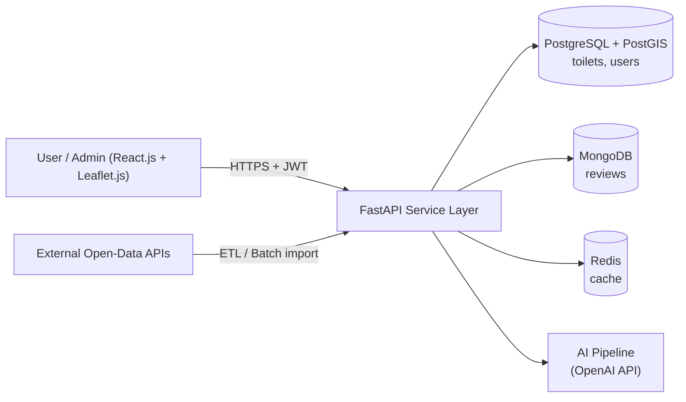

# Requirements Definition Report - SmartLoo

> **Project:** SmartLoo – Smart Urban Hygiene Management System
> **Course:** CMPE 331 – Software Engineering
> **Deliverable:** Requirements Definition Report
> **Deadline:** 11.10.2026 23:59
> **Repository:** https://github.com/akcedia/SmartLoo
> **Related Issue:** #1 – Core BDD Scenarios (Search & Filter Features)
> **Status:** Draft v0.1

This document defines the functional and non-functional requirements of SmartLoo. Functional requirements are written as user stories with acceptance criteria in **BDD (Gherkin: Given–When–Then)** format. Each scenario maps to one or more test specifications, in line with the project's **Test-Driven Development (TDD)** approach described in the [Project Charter](./CHARTER.MD).

---

## Table of Contents

1. [System Overview & Scope](#1-system-overview--scope)
2. [Functional Requirements & BDD Scenarios](#2-functional-requirements--bdd-scenarios)
3. [Non-Functional Requirements](#3-non-functional-requirements)
4. [Test Specifications (TDD Alignment)](#4-test-specifications-tdd-alignment)
5. [External Interfaces & Data Sources](#5-external-interfaces--data-sources)
6. [Traceability Matrix](#6-traceability-matrix)
7. [Glossary](#7-glossary)

---

## 1. System Overview & Scope

### 1.1 Purpose
SmartLoo is a web platform for finding public toilets in Istanbul. It collects their locations, hygiene status and accessibility features in one place. End users can find nearby, accessible and clean toilets on an interactive map. Municipal administrators get an analytics dashboard for monitoring hygiene and user feedback.

### 1.2 Actors

| Actor | Description |
|-------|-------------|
| **Guest User** | An unauthenticated visitor who can search, filter and view toilets on the map. |
| **Registered User** | An authenticated user (JWT) who can also submit ratings and reviews and suggest new toilet locations. |
| **Administrator / Cleaning Manager** | A privileged user (RBAC role `admin`) who can use the analytics dashboard, moderate content, and import or export data. |
| **AI Pipeline (System Actor)** | A backend service using the OpenAI API to summarize reviews and generate recommendations. |
| **External Data Provider (System Actor)** | Open-data APIs that provide toilet locations and metadata. |

### 1.3 High-Level Architecture



### 1.4 Scope Summary
- **In-Scope:** proximity search and filtering, ratings and reviews, AI review summarization and recommendations, JWT authentication with RBAC, analytics dashboard, CSV/JSON batch import and export, user-suggested toilet locations.
- **Out-of-Scope:** staff shift and salary optimization, IoT occupancy and supply sensors, in-app payments (see Charter §3).

---

## 2. Functional Requirements & BDD Scenarios

### 2.1 Functional Requirements Summary

| ID | Requirement | Priority | Owner |
|----|-------------|----------|-------|
| FR-01 | The system shall return the nearest **open** public toilets within a user-specified radius, sorted by distance. | Must | Backend / Map UX |
| FR-02 | The system shall filter toilets by accessibility and amenities (disabled access, baby changing room, free/paid). | Must | Backend / Map UX |
| FR-03 | Authenticated users shall be able to submit a cleanliness rating (1–5) and a text review. | Must | Backend / DB & Security |
| FR-04 | The system shall generate an AI summary of the aggregated reviews for a toilet and give a recommendation. | Must | AI Pipeline |
| FR-05 | Users shall be able to suggest new toilet locations for admin approval. | Should | Backend / Map UX |
| FR-06 | Administrators shall see hygiene statistics with date-based filtering on a dashboard. | Must | Frontend / Analytics |
| FR-07 | Administrators shall be able to import (CSV/JSON) and export analysis reports. | Should | Backend |

> [!NOTE]
> FR-01 to FR-04 are covered by Issue #1 and are detailed below. FR-05 to FR-07 will get BDD scenarios in later issues.

---

### 2.2 Feature: Proximity-Based Search (FR-01)

**User Story**
> As a **city resident or tourist**,
> I want to **see the nearest open public toilets within a chosen radius on the map**,
> so that I can **reach one quickly**.

```gherkin
Feature: Proximity-based search for public toilets
  In order to quickly find a nearby facility
  As a user of the SmartLoo web app
  I want to see the nearest open public toilets within a given radius

  Background:
    Given the toilet database contains the following records:
      | id | name                    | latitude  | longitude | is_open_now |
      | 1  | Taksim Square WC        | 41.0369   | 28.9850   | true        |
      | 2  | Istiklal Avenue WC      | 41.0340   | 28.9780   | true        |
      | 3  | Galata Tower WC         | 41.0256   | 28.9742   | false       |
      | 4  | Kadikoy Pier WC         | 40.9910   | 29.0230   | true        |
    And each toilet location is stored as a PostGIS "geography(Point, 4326)"

  Scenario: Locate nearest open toilets within a specified radius
    Given I have granted location access with coordinates "41.0360, 28.9840"
    And I have selected a search radius of 1000 meters
    When I request nearby toilets via "GET /api/v1/toilets/nearby?lat=41.0360&lon=28.9840&radius=1000&open_now=true"
    Then the response status code should be 200
    And the response should contain toilets "Taksim Square WC" and "Istiklal Avenue WC"
    And the response should not contain "Galata Tower WC" because it is closed
    And the response should not contain "Kadikoy Pier WC" because it is outside the radius
    And the results should be sorted by "distance_m" in ascending order
    And each result should include "id", "name", "latitude", "longitude" and "distance_m"
    And the Leaflet map should display one marker per returned toilet
    And the map should fit its bounds to the search radius circle

  Scenario: No open toilets found within the radius
    Given I am located at "41.0800, 29.0500"
    And I have selected a search radius of 200 meters
    When I request nearby toilets with "open_now=true"
    Then the response status code should be 200
    And the response body "results" should be an empty list
    And the UI should show the message "No open toilets found nearby. Try increasing the search radius."

  Scenario Outline: Reject invalid search parameters
    When I request nearby toilets with lat "<lat>", lon "<lon>" and radius "<radius>"
    Then the response status code should be 422
    And the error message should mention "<field>"

    Examples:
      | lat   | lon    | radius | field  |
      | 95.0  | 28.98  | 1000   | lat    |
      | 41.03 | 200.0  | 1000   | lon    |
      | 41.03 | 28.98  | -50    | radius |
      | 41.03 | 28.98  | 50001  | radius |
```

**Implementation Notes**
- Spatial query uses `ST_DWithin(location, ST_MakePoint(:lon, :lat)::geography, :radius)` together with `ST_Distance` for ordering. A GIST index on `location` is required.
- `is_open_now` is computed server-side from `opening_hours` in the `Europe/Istanbul` time zone.
- Allowed radius range: 1 m – 50,000 m (default 1,000 m).

---

### 2.3 Feature: Filtering by Accessibility & Amenities (FR-02)

**User Story**
> As a **wheelchair user or a parent with an infant**,
> I want to **filter toilets by accessibility and amenities**,
> so that I **only see facilities I can actually use**.

```gherkin
Feature: Filter toilets by accessibility and amenities
  In order to find a facility that meets my specific needs
  As a user of the SmartLoo web app
  I want to filter search results by accessibility features and pricing

  Background:
    Given the toilet database contains the following records:
      | id | name               | has_disabled_access | has_baby_changing | is_free | price_try |
      | 1  | Taksim Square WC   | true                | true              | false   | 10.00     |
      | 2  | Istiklal Avenue WC | false               | true              | true    | 0.00      |
      | 3  | Sishane Metro WC   | true                | false             | true    | 0.00      |
      | 4  | Cihangir Park WC   | false               | false             | false   | 5.00      |
    And all toilets are within 2000 meters of "41.0340, 28.9800"

  Scenario: Filter by wheelchair accessibility
    Given I am located at "41.0340, 28.9800"
    When I enable the "Wheelchair Accessible" filter
    And the app sends "GET /api/v1/toilets/nearby?lat=41.0340&lon=28.9800&radius=2000&has_disabled_access=true"
    Then the response status code should be 200
    And every toilet in the response should have "has_disabled_access" equal to true
    And the response should contain exactly "Taksim Square WC" and "Sishane Metro WC"
    And the map should show a wheelchair icon on each returned marker

  Scenario: Combine multiple amenity filters
    Given I am located at "41.0340, 28.9800"
    When I enable the "Wheelchair Accessible" filter
    And I enable the "Baby Changing Room" filter
    Then only "Taksim Square WC" should be returned
    And the active filter chips "Wheelchair Accessible" and "Baby Changing Room" should be visible

  Scenario Outline: Filter by pricing status
    Given I am located at "41.0340, 28.9800"
    When I set the pricing filter to "<pricing>"
    Then every toilet in the response should have "is_free" equal to <is_free>
    And the number of results should be <count>

    Examples:
      | pricing | is_free | count |
      | Free    | true    | 2     |
      | Paid    | false   | 2     |

  Scenario: Filters that match no toilets
    Given I am located at "41.0340, 28.9800"
    When I enable the "Baby Changing Room" filter
    And I set the pricing filter to "Free"
    And I enable the "Wheelchair Accessible" filter
    Then the response body "results" should be an empty list
    And the UI should suggest "Remove some filters to see more results."

  Scenario: Clearing filters restores the full result set
    Given I have the "Wheelchair Accessible" filter enabled
    When I click "Clear all filters"
    Then all 4 toilets should be displayed on the map
```

**Implementation Notes**
- Filters are optional boolean query parameters (`has_disabled_access`, `has_baby_changing`, `is_free`) combined with logical **AND**.
- An omitted filter means "no constraint", not `false`.

---

### 2.4 Feature: User Hygiene Rating & Review Submission (FR-03)

**User Story**
> As a **registered user**,
> I want to **rate a toilet's cleanliness and write a short review**,
> so that **other users and municipal managers know its current hygiene status**.

```gherkin
Feature: Submit a hygiene rating and review
  In order to share my experience and improve hygiene transparency
  As an authenticated SmartLoo user
  I want to submit a cleanliness score and written feedback for a toilet

  Background:
    Given a toilet exists with id 1 and name "Taksim Square WC"
    And a registered user "ayse@example.com" exists with role "user"

  Scenario: Authenticated user submits a valid rating and review
    Given I am logged in as "ayse@example.com" with a valid JWT access token
    When I send "POST /api/v1/toilets/1/reviews" with the body:
      """
      {
        "cleanliness_score": 4,
        "comment": "Clean and well-lit, but the soap dispenser was empty.",
        "tags": ["well-lit", "no-soap"]
      }
      """
    Then the response status code should be 201
    And a review document should be stored in the MongoDB "reviews" collection with:
      | field             | value                 |
      | toilet_id         | 1                     |
      | user_id           | <id of ayse>          |
      | cleanliness_score | 4                     |
      | created_at        | <current UTC time>    |
    And the toilet's "average_cleanliness" and "review_count" should be recalculated
    And the cached statistics for toilet 1 should be invalidated in Redis
    And I should see the confirmation "Thank you! Your review has been submitted."

  Scenario: Guest user attempts to submit a review
    Given I am not logged in
    When I send "POST /api/v1/toilets/1/reviews" without an Authorization header
    Then the response status code should be 401
    And no document should be inserted into the "reviews" collection
    And the UI should redirect me to the login page

  Scenario: Expired token is rejected
    Given I am logged in with an expired JWT access token
    When I submit a review for toilet 1
    Then the response status code should be 401
    And the error code should be "token_expired"

  Scenario Outline: Invalid review payload is rejected
    Given I am logged in as "ayse@example.com"
    When I submit a review for toilet 1 with cleanliness_score <score> and comment "<comment>"
    Then the response status code should be 422
    And the error message should mention "<field>"

    Examples:
      | score | comment                    | field             |
      | 0     | Too dirty                  | cleanliness_score |
      | 6     | Perfect                    | cleanliness_score |
      | 3     | <comment of 1001 chars>    | comment           |

  Scenario: Prevent duplicate reviews in a short time window
    Given I am logged in as "ayse@example.com"
    And I already submitted a review for toilet 1 within the last 24 hours
    When I submit another review for toilet 1
    Then the response status code should be 409
    And the error message should be "You can review the same toilet once every 24 hours."
```

**Implementation Notes**
- `cleanliness_score`: integer 1–5 (required). `comment`: 0–1000 characters (optional). `tags`: optional array of predefined values.
- Reviews live in MongoDB. Aggregate values (`average_cleanliness`, `review_count`) are denormalized into PostgreSQL for fast filtering and sorting.

---

### 2.5 Feature: AI-Powered Review Summarization & Recommendation (FR-04)

**User Story**
> As a **user planning to visit a toilet**,
> I want to **read a short AI-generated summary of its reviews**,
> so that I can **decide quickly whether to go there without reading every review**.

```gherkin
Feature: AI-powered review summarization and recommendation
  In order to make an informed decision before visiting a facility
  As a SmartLoo user
  I want to see an AI-generated summary of aggregated reviews and a recommendation

  Background:
    Given toilet 1 "Taksim Square WC" has 25 reviews stored in MongoDB
    And the average cleanliness score of toilet 1 is 3.8
    And the AI Pipeline is configured with a valid OpenAI API key

  Scenario: Display an AI summary for a toilet with enough reviews
    Given no valid cached summary exists for toilet 1 in Redis
    When I open the details panel of "Taksim Square WC" on the map
    And the app sends "GET /api/v1/toilets/1/summary"
    Then the backend should send the 50 most recent reviews to the AI Pipeline
    And the response status code should be 200
    And the response should contain:
      | field            | constraint                                         |
      | summary          | non-empty text, at most 400 characters             |
      | pros             | list of 1 to 3 short phrases                       |
      | cons             | list of 0 to 3 short phrases                       |
      | recommendation   | one of "recommended", "acceptable", "avoid"        |
      | based_on_reviews | 25                                                 |
      | generated_at     | ISO-8601 timestamp                                 |
    And the summary should be cached in Redis with a TTL of 6 hours
    And the details panel should show the label "AI-generated summary"

  Scenario: Serve cached summary
    Given a valid cached summary exists for toilet 1 in Redis
    When I request "GET /api/v1/toilets/1/summary"
    Then the response should be returned from the cache
    And the OpenAI API should not be called

  Scenario: Regenerate summary after new reviews
    Given a cached summary exists for toilet 1
    When 5 new reviews are submitted for toilet 1
    Then the cached summary for toilet 1 should be invalidated
    And the next summary request should generate a new summary

  Scenario: Not enough reviews to summarize
    Given toilet 4 "Cihangir Park WC" has only 2 reviews
    When I request "GET /api/v1/toilets/4/summary"
    Then the response status code should be 200
    And the field "summary" should be null
    And the field "message" should be "Not enough reviews to generate a summary (minimum 3)."
    And the OpenAI API should not be called

  Scenario: Graceful degradation when the AI service is unavailable
    Given the OpenAI API returns an error or times out after 10 seconds
    When I request "GET /api/v1/toilets/1/summary"
    Then the response status code should be 200
    And the field "summary" should be null
    And the response should include "average_cleanliness" and "review_count" as a fallback
    And the UI should show "Summary temporarily unavailable."
    And the error should be logged with a correlation id

  Scenario: Personalized recommendation based on user preferences
    Given I am logged in and my saved preferences are "has_disabled_access=true" and "is_free=true"
    And I am located at "41.0340, 28.9800"
    When I request "GET /api/v1/recommendations?lat=41.0340&lon=28.9800"
    Then the response should contain at most 3 toilets that satisfy my preferences
    And each recommended toilet should include a one-sentence "reason" produced by the AI Pipeline
    And the toilets should be ranked using distance, average cleanliness and review sentiment
```

**Implementation Notes**
- Before reviews are sent to the OpenAI API, personally identifiable information (user names, e-mails) is removed.
- The AI response must follow a strict JSON schema (structured output). If schema validation fails, the fallback path is used.
- Reviews are treated as untrusted input to reduce prompt-injection risk: system instructions are kept separate from user content.

---

## 3. Non-Functional Requirements

| ID | Category | Requirement | Target / Metric | Verification |
|----|----------|-------------|-----------------|--------------|
| NFR-01 | **Performance** | Spatial queries (`/toilets/nearby`, with or without filters) must be fast. | p95 latency **< 250 ms** with 10,000 toilet records and 50 concurrent users. | Load test (Locust/k6) in CI against a staging DB. |
| NFR-02 | **Performance** | Cached AI summary responses. | p95 latency **< 100 ms** on a cache hit. Uncached generation **< 8 s**. | Load test plus Redis hit-ratio monitoring. |
| NFR-03 | **Security** | Authentication and authorization. | JWT (HS256/RS256) access token valid for **15 min**, refresh token valid for **7 days**. Passwords hashed with **bcrypt** (cost ≥ 12). RBAC roles: `guest`, `user`, `admin`. | Unit and integration tests for protected endpoints, plus security review. |
| NFR-04 | **Security** | Transport and input security. | All traffic over **HTTPS (TLS 1.2+)**. All input validated with Pydantic. Rate limit of **10 review submissions per user per hour**. Protection against OWASP Top 10 (injection, XSS). | Automated tests plus OWASP ZAP baseline scan. |
| NFR-05 | **Usability / Responsiveness** | The map must stay responsive. | First map render **< 2 s** on 4G. Pan/zoom at **≥ 30 FPS** with up to 500 visible markers (using marker clustering). Responsive layout from **360 px** to **1920 px**. | Lighthouse (Performance ≥ 85), manual device testing. |
| NFR-06 | **Accessibility** | The UI must be accessible. | Conforms to **WCAG 2.1 Level AA** (keyboard navigation, contrast ratio ≥ 4.5:1, ARIA labels on filters). | Lighthouse Accessibility ≥ 90, axe-core checks. |
| NFR-07 | **Availability** | Service uptime. | **99%** monthly uptime for the public API. If the AI service fails, core search must keep working. | Uptime monitoring, chaos test (AI service disabled). |
| NFR-08 | **Privacy** | Personal data protection. | Complies with **KVKK** (Turkish Data Protection Law). Location data is not stored without consent. No PII is sent to the AI provider. | Code review plus data-flow audit. |
| NFR-09 | **Maintainability** | Code quality. | Backend test coverage **≥ 80%**. CI pipeline (lint, test, build) must pass before merging to `main`. | GitHub Actions and coverage report. |
| NFR-10 | **Localization** | Language support. | UI available in **Turkish and English**. | Manual UI review. |

---

## 4. Test Specifications (TDD Alignment)

> [!IMPORTANT]
> Following TDD, every test case below is written **before** its implementation and must fail at first. Each test case refers back to a BDD scenario (§2) and/or an NFR (§3). The QA Engineer extends this section using the template in §4.3.

### 4.1 Test Environment
- **Backend:** `pytest` + `httpx.AsyncClient` (FastAPI TestClient), using a dedicated PostgreSQL/PostGIS test database seeded from fixtures.
- **NoSQL / Cache:** MongoDB and Redis test containers (`testcontainers` or docker-compose `test` profile).
- **AI Pipeline:** OpenAI client mocked with deterministic fixtures. No real API calls run in CI.
- **Frontend:** Jest + React Testing Library (unit), Playwright (E2E).
- **BDD Runner:** `pytest-bdd` executes the `.feature` files from §2.
- **Performance:** k6 or Locust.

### 4.2 Functional Test Cases

#### TC-01: Filter nearby toilets by wheelchair accessibility

| Field | Details |
|-------|---------|
| **Test Case ID** | TC-01 |
| **Title** | Nearby search returns only toilets with `has_disabled_access == true` when the filter is enabled |
| **Related Requirement** | FR-02 |
| **Related Scenario** | §2.3 – *Filter by wheelchair accessibility* |
| **Type** | Functional / API Integration |
| **Priority** | High |
| **Preconditions** | 1. Test DB is seeded with the 4 toilets from the §2.3 Background table.<br/>2. All toilets are within 2000 m of `41.0340, 28.9800`.<br/>3. API service is running. No authentication is required (public endpoint). |
| **Test Data** | `lat=41.0340`, `lon=28.9800`, `radius=2000`, `has_disabled_access=true` |
| **Steps** | 1. Send `GET /api/v1/toilets/nearby?lat=41.0340&lon=28.9800&radius=2000&has_disabled_access=true`.<br/>2. Parse the JSON response body.<br/>3. Go through every element of `results`. |
| **Expected Result** | 1. HTTP status is `200 OK`.<br/>2. `Content-Type` is `application/json`.<br/>3. `results` has length **2**.<br/>4. Every element has `has_disabled_access == true`.<br/>5. Returned `id` set is exactly `{1, 3}`.<br/>6. Results are sorted by `distance_m` ascending.<br/>7. Response time < 250 ms (NFR-01). |
| **Postconditions** | No data is modified (read-only endpoint). |
| **Status** | Not Run |

**Sample expected response:**
```json
{
  "query": { "lat": 41.0340, "lon": 28.9800, "radius": 2000, "filters": { "has_disabled_access": true } },
  "count": 2,
  "results": [
    { "id": 3, "name": "Sishane Metro WC", "has_disabled_access": true, "has_baby_changing": false, "is_free": true,  "distance_m": 412.6 },
    { "id": 1, "name": "Taksim Square WC", "has_disabled_access": true, "has_baby_changing": true,  "is_free": false, "distance_m": 655.1 }
  ]
}
```
> Distance values are illustrative. The test checks ordering, not exact values.

**Reference test skeleton (pytest):**
```python
# tests/api/test_toilets_filter.py
import pytest

@pytest.mark.asyncio
async def test_tc01_filter_has_disabled_access(client, seed_toilets):
    params = {
        "lat": 41.0340,
        "lon": 28.9800,
        "radius": 2000,
        "has_disabled_access": "true",
    }
    response = await client.get("/api/v1/toilets/nearby", params=params)

    assert response.status_code == 200
    assert response.headers["content-type"].startswith("application/json")

    results = response.json()["results"]
    assert len(results) == 2
    assert all(t["has_disabled_access"] is True for t in results)
    assert {t["id"] for t in results} == {1, 3}

    distances = [t["distance_m"] for t in results]
    assert distances == sorted(distances)
```

#### Planned Test Cases (to be completed by QA)

| Test Case ID | Title | Related Scenario / NFR | Type | Status |
|--------------|-------|------------------------|------|--------|
| TC-02 | Nearby search returns only open toilets within radius, sorted by distance | §2.2 / FR-01 | API Integration | TODO |
| TC-03 | Invalid lat/lon/radius returns 422 | §2.2 / FR-01 | API Validation | TODO |
| TC-04 | Combined filters (disabled access + baby changing) use AND logic | §2.3 / FR-02 | API Integration | TODO |
| TC-05 | Pricing filter (`is_free`) returns correct subset | §2.3 / FR-02 | API Integration | TODO |
| TC-06 | Authenticated review submission persists to MongoDB and returns 201 | §2.4 / FR-03 | API Integration | TODO |
| TC-07 | Review submission without JWT returns 401 | §2.4 / FR-03, NFR-03 | Security | TODO |
| TC-08 | Out-of-range `cleanliness_score` returns 422 | §2.4 / FR-03 | API Validation | TODO |
| TC-09 | AI summary returns schema-valid JSON and is cached in Redis | §2.5 / FR-04 | Integration (mocked AI) | TODO |
| TC-10 | AI service outage falls back to aggregate stats | §2.5 / FR-04, NFR-07 | Resilience | TODO |
| TC-11 | Fewer than 3 reviews: no AI call is made | §2.5 / FR-04 | Unit | TODO |
| TC-NF-01 | `/toilets/nearby` p95 < 250 ms at 50 concurrent users | NFR-01 | Performance | TODO |
| TC-NF-02 | Lighthouse Performance ≥ 85, Accessibility ≥ 90 | NFR-05, NFR-06 | Non-Functional | TODO |

### 4.3 Test Case Template

```markdown
#### TC-XX: <Title>
| Field | Details |
|-------|---------|
| **Test Case ID** | TC-XX |
| **Title** | |
| **Related Requirement** | FR-XX / NFR-XX |
| **Related Scenario** | §2.X – <Scenario name> |
| **Type** | Unit / Integration / E2E / Performance / Security |
| **Priority** | High / Medium / Low |
| **Preconditions** | |
| **Test Data** | |
| **Steps** | |
| **Expected Result** | |
| **Postconditions** | |
| **Status** | Not Run / Pass / Fail |
```

---

## 5. External Interfaces & Data Sources

### 5.1 External Data Sources

| Source | Data Provided | Access Method | Usage |
|--------|---------------|---------------|-------|
| **İBB Open Data Portal** (`data.ibb.gov.tr`) | Municipal public toilet locations and metadata (where available) | CKAN REST API / CSV-JSON download | Primary seed data for Istanbul toilets |
| **OpenStreetMap – Overpass API** | `amenity=toilets` nodes with tags `wheelchair`, `changing_table`, `fee`, `opening_hours` | HTTP Overpass QL queries | Supplementary locations and amenity attributes |
| **OpenStreetMap Tile Servers** (or a compatible tile provider) | Base map tiles | XYZ tile URLs via Leaflet.js | Map rendering |
| **OpenAI API** | LLM completions with structured output | HTTPS REST (API key, server-side only) | Review summarization and recommendations |
| **Admin Batch Import** | CSV/JSON files uploaded by administrators | `POST /api/v1/admin/import` | Manual data correction and enrichment |

> [!WARNING]
> The availability, licensing (e.g., ODbL for OSM) and update frequency of each external dataset must be checked during the Requirement Analysis phase. Imported data must be deduplicated (e.g., records within 25 m with similar names are merged).

### 5.2 Internal API Interface (Initial Draft)

| Method | Endpoint | Auth | Description |
|--------|----------|------|-------------|
| `GET` | `/api/v1/toilets/nearby` | Public | Proximity search with optional filters (FR-01, FR-02) |
| `GET` | `/api/v1/toilets/{id}` | Public | Toilet details |
| `GET` | `/api/v1/toilets/{id}/reviews` | Public | Paginated reviews |
| `POST` | `/api/v1/toilets/{id}/reviews` | `user` | Submit rating and review (FR-03) |
| `GET` | `/api/v1/toilets/{id}/summary` | Public | AI review summary (FR-04) |
| `GET` | `/api/v1/recommendations` | `user` | Personalized AI recommendations (FR-04) |
| `POST` | `/api/v1/auth/register` | Public | User registration |
| `POST` | `/api/v1/auth/login` | Public | Obtain JWT access and refresh tokens |
| `POST` | `/api/v1/auth/refresh` | Public | Refresh access token |
| `POST` | `/api/v1/admin/import` | `admin` | Batch CSV/JSON import (FR-07) |
| `GET` | `/api/v1/admin/stats` | `admin` | Dashboard statistics (FR-06) |

### 5.3 Core Data Model (Initial Draft)

**PostgreSQL / PostGIS – `toilets`**

| Column | Type | Notes |
|--------|------|-------|
| `id` | `SERIAL PK` | |
| `name` | `VARCHAR(150)` | |
| `location` | `GEOGRAPHY(Point, 4326)` | GIST index |
| `district` | `VARCHAR(50)` | e.g., Beyoğlu, Kadıköy |
| `has_disabled_access` | `BOOLEAN` | default `false` |
| `has_baby_changing` | `BOOLEAN` | default `false` |
| `is_free` | `BOOLEAN` | |
| `price_try` | `NUMERIC(6,2)` | `0.00` if free |
| `opening_hours` | `VARCHAR(255)` | OSM `opening_hours` syntax |
| `average_cleanliness` | `NUMERIC(3,2)` | denormalized from MongoDB |
| `review_count` | `INTEGER` | denormalized |
| `source` | `VARCHAR(30)` | `ibb`, `osm`, `user`, `admin` |
| `created_at` / `updated_at` | `TIMESTAMPTZ` | |

**MongoDB – `reviews` collection**

```json
{
  "_id": "ObjectId",
  "toilet_id": 1,
  "user_id": 42,
  "cleanliness_score": 4,
  "comment": "Clean and well-lit, but the soap dispenser was empty.",
  "tags": ["well-lit", "no-soap"],
  "created_at": "2026-10-03T09:30:00Z"
}
```

---

## 6. Traceability Matrix

| Requirement | BDD Scenario(s) | Test Case(s) | Related NFR |
|-------------|-----------------|--------------|-------------|
| FR-01 | §2.2 | TC-02, TC-03 | NFR-01, NFR-05 |
| FR-02 | §2.3 | **TC-01**, TC-04, TC-05 | NFR-01, NFR-06 |
| FR-03 | §2.4 | TC-06, TC-07, TC-08 | NFR-03, NFR-04 |
| FR-04 | §2.5 | TC-09, TC-10, TC-11 | NFR-02, NFR-07, NFR-08 |
| FR-05 | TBD | TBD | NFR-03 |
| FR-06 | TBD | TBD | NFR-03, NFR-05 |
| FR-07 | TBD | TBD | NFR-03 |

---

## 7. Glossary

| Term | Definition |
|------|------------|
| **BDD** | Behavior-Driven Development: requirements written as executable Given–When–Then scenarios. |
| **Gherkin** | The structured plain-language syntax used for BDD scenarios. |
| **TDD** | Test-Driven Development: tests are written before the implementation. |
| **PostGIS** | Spatial extension for PostgreSQL that supports geographic queries. |
| **JWT** | JSON Web Token: a signed token used for stateless authentication. |
| **RBAC** | Role-Based Access Control. |
| **p95 latency** | The response time that 95% of requests stay under. |
| **KVKK** | Kişisel Verilerin Korunması Kanunu (Turkish Personal Data Protection Law). |
| **TTL** | Time-To-Live: how long a cache entry stays valid. |

---

*Document history:*

| Version | Date | Author | Change |
|---------|------|--------|--------|
| 0.1 | 03.10.2026 | SmartLoo Team | Initial skeleton and core BDD scenarios (Issue #1) |
