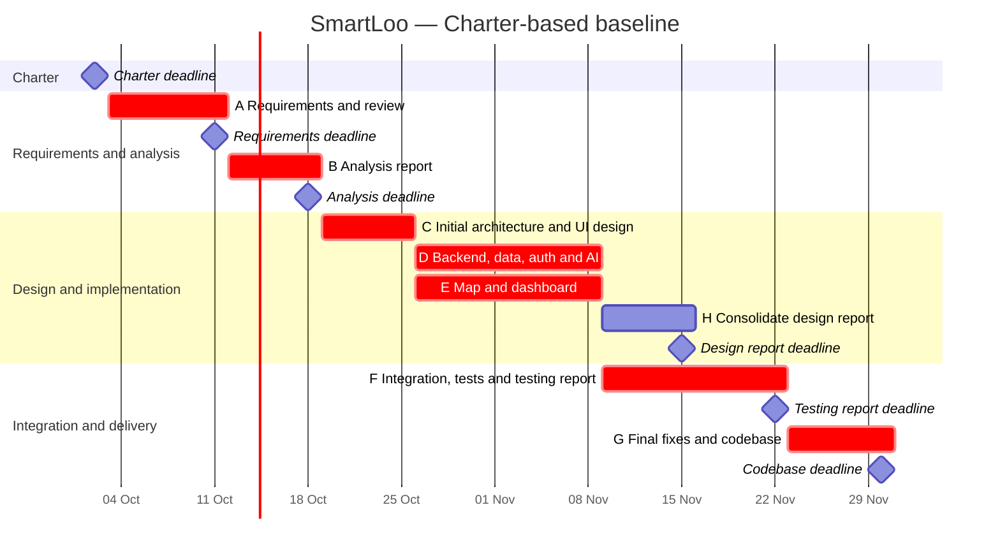

# SmartLoo — Gantt schedule

Baseline revision: 10 October 2026. Fixed milestones come from [Charter section 5](../CHARTER.MD); task durations and dependency assumptions come from [PERT](PERT.md). This is a planned baseline, not a completed-work record. Dates include weekends. The Mermaid chart marks milestone dates; the authoritative deadline time is **23:59**, not midnight at the rendered marker.

Task bars use an exclusive end boundary; the table states the final working day, inclusively. For example, A's nine-day bar begins 3 October and ends at the start of 12 October, covering work through 11 October.

| Activity / milestone | Planned start | Last working day / fixed deadline | Dependency | WBS |
|---|---|---|---|---|
| Charter milestone | — | 2 Oct 2026, 23:59 | Course milestone | 1 |
| A Requirements, tests, diagrams, review and final submission | 3 Oct | 11 Oct 2026, 23:59 | Charter | 2 |
| B Requirement analysis report | 12 Oct | 18 Oct 2026, 23:59 | A | 3 |
| C Initial architecture, API/schema and UI design | 19 Oct | 25 Oct | B | 4.1–4.2 |
| D Backend/data/auth/AI implementation | 26 Oct | 8 Nov | C | 5.1–5.3 |
| E Map/dashboard implementation | 26 Oct | 8 Nov | C | 5.4–5.5 |
| H Consolidate/review software design report | 9 Nov | 15 Nov 2026, 23:59 | D, E | 4.3 |
| F Integration, acceptance/NFR testing and testing report | 9 Nov | 22 Nov 2026, 23:59 | D, E | 6 |
| G Final fixes, regression checks and codebase delivery | 23 Nov | 30 Nov 2026, 23:59 | F, H | 7 |
| Presentation | TBA | TBA (course schedule) | Final demonstration preparation | 8 |

Implementation is deliberately planned before the design-report submission date, following the initial design C. Testing overlaps final design documentation. The requirements-review PR target of 8 October comes from the submission announcement and is a review checkpoint inside A; the Charter's final requirements milestone remains 11 October. Approval and PDF submission must be verified independently.

Owners are defined in the WBS. Past dates are baseline targets and do not imply observed completion. Re-plan against the same fixed deadlines when actual progress or review feedback changes the assumptions.
