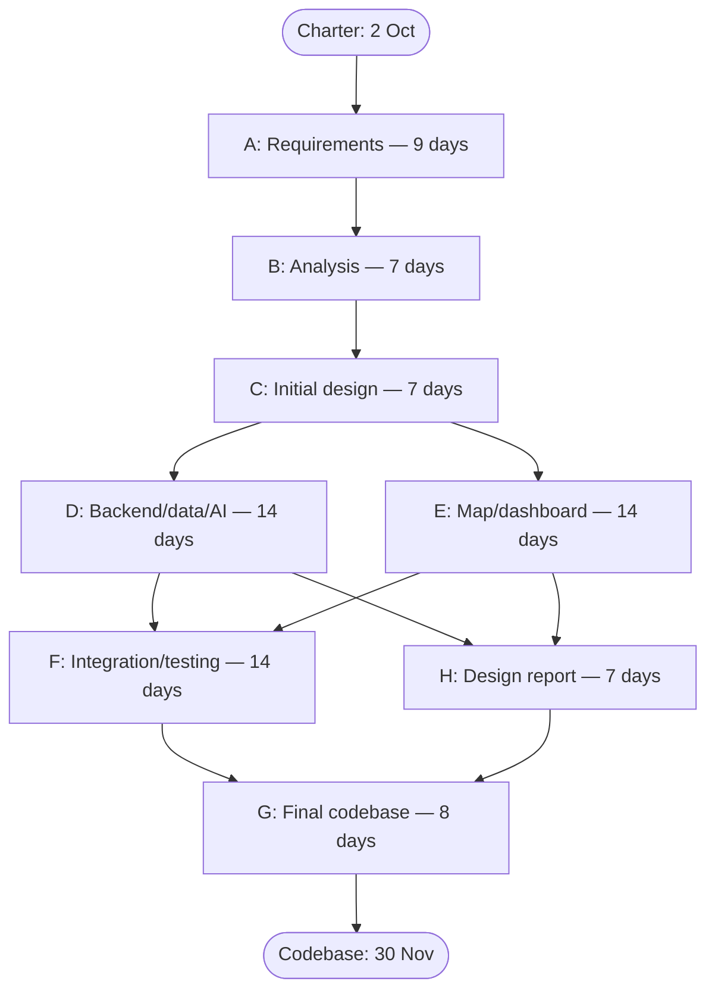

# SmartLoo — PERT analysis

Baseline revision: 10 October 2026. Derived from [Charter milestones](../CHARTER.MD) and [WBS](WBS.md). The Charter sets deadlines; **it does not provide effort estimates**. O/M/P values below are proposed team estimates in elapsed calendar days, assuming parallel work by the assigned owners, including weekends. They are not observed durations or person-days. Charter preparation ends on 2 October and precedes this network, which starts on 3 October.

Expected duration: `tE = (O + 4M + P) / 6`; variance: `((P − O) / 6)²`. Values are symmetric so tE equals M. The [Gantt](GANTT.md) uses these tE durations.

| Activity | WBS / output | Owner | Predecessor | O | M | P | tE | Variance |
|---|---|---|---|---:|---:|---:|---:|---:|
| A | 2 — Requirements definition and review | Özgür / all | Charter | 7 | 9 | 11 | 9 | 0.44 |
| B | 3 — Requirement analysis report | Özgür / all | A | 5 | 7 | 9 | 7 | 0.44 |
| C | 4.1–4.2 — Initial technical/UI design | Özgür / all | B | 5 | 7 | 9 | 7 | 0.44 |
| D | 5.1–5.3 — Backend, persistence/auth and AI | Özgür, Fırat, Emir; Yusuf support | C | 10 | 14 | 18 | 14 | 1.78 |
| E | 5.4–5.5 — Map and dashboard frontend | Furkan, Onur; Yusuf support | C | 10 | 14 | 18 | 14 | 1.78 |
| F | 6 — Integration, acceptance/NFR tests and testing report | Yusuf / all | D, E | 10 | 14 | 18 | 14 | 1.78 |
| H | 4.3 — Consolidate and review design report | Özgür / all | D, E | 5 | 7 | 9 | 7 | 0.44 |
| G | 7 — Final fixes, regression checks and codebase delivery | Özgür, Yusuf / all | F, H | 6 | 8 | 10 | 8 | 0.44 |

Activities D and E run concurrently with different domain owners. H uses documentation/review effort during F; this assumption must be revisited if team capacity cannot support both. C produces the initial design before coding; H documents the resulting integrated design by its fixed deadline.

## Forward/backward pass

Day 0 is the start of 3 October. ES/EF/LS/LF are elapsed-day boundaries; an activity with ES=0 and EF=9 occupies 3–11 October. Backward pass is calculated against the 59-day codebase finish. Network float is distinct from slack against each fixed intermediate deadline.

| Activity | ES | EF | LS | LF | Network float | Calendar window |
|---|---:|---:|---:|---:|---:|---|
| A | 0 | 9 | 0 | 9 | 0 | 3–11 Oct |
| B | 9 | 16 | 9 | 16 | 0 | 12–18 Oct |
| C | 16 | 23 | 16 | 23 | 0 | 19–25 Oct |
| D | 23 | 37 | 23 | 37 | 0 | 26 Oct–8 Nov |
| E | 23 | 37 | 23 | 37 | 0 | 26 Oct–8 Nov |
| F | 37 | 51 | 37 | 51 | 0 | 9–22 Nov |
| H | 37 | 44 | 44 | 51 | 7 | 9–15 Nov |
| G | 51 | 59 | 51 | 59 | 0 | 23–30 Nov |

Two critical paths: **A → B → C → D → F → G** and **A → B → C → E → F → G**. Both total **59 calendar days**. H has seven days of network float relative to the codebase, but **zero usable float against the 15 November design-report deadline**. Requirements (A), analysis (B), design report (H), testing report (F) and codebase (G) all finish exactly at their Charter dates in this baseline; there is no delivery buffer.

Risk: optimistic/most-likely/pessimistic ranges express uncertainty, not a guarantee of meeting these dates. Under independent-duration assumptions, each critical path's variance is approximately 5.33 days² (standard deviation about 2.31 days). This is not a confidence estimate for the whole network; parallel paths and shared staff can be correlated. Track progress and reduce scope or reallocate work if a critical activity slips. Presentation planning remains outside the dated network because the Charter says TBA.
