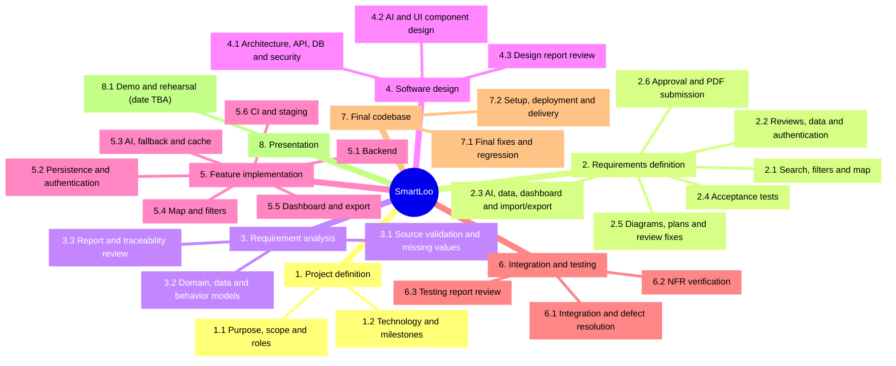

# SmartLoo — Work Breakdown Structure (WBS)

Baseline revision: 10 October 2026. Schedule authority: [Project Charter, section 5](../CHARTER.MD). This is a deliverable-based plan, not evidence that future work has been completed. Owners follow the Charter; shared tasks are integrated by Özgür and checked by Yusuf. The calendar and activity estimates are in [Gantt](GANTT.md) and [PERT](PERT.md).

## WBS diagram

The diagram decomposes the same numbered work packages listed in the table. Branches represent work decomposition, not chronological dependencies; PERT and Gantt define those.

## Work package details

| WBS | Deliverable / work package | Lead / contributors | Completion evidence | Charter milestone |
|---|---|---|---|---|
| 1 | Project definition | Özgür / all | Reviewed Charter | 2 October 2026 |
| 1.1 | Purpose, scope, stakeholders and roles | Özgür / all | `docs/CHARTER.MD` | Charter |
| 1.2 | Technology and milestone baseline | Özgür / all | Charter sections 4–5 | Charter |
| 2 | Requirements definition (PERT A) | Özgür / all | Requirements report and review PR | 11 October 2026 |
| 2.1 | Location, filtering and map stories | Özgür, Furkan | FR-01, FR-02, FR-09 | Requirements |
| 2.2 | Reviews, data constraints and authentication | Fırat / Özgür | FR-03, FR-08, FR-10 and detailed security specification | Requirements |
| 2.3 | AI, external data, dashboard and import/export | Emir, Onur | FR-04–FR-07; source and field rules | Requirements |
| 2.4 | Functional and non-functional acceptance tests | Yusuf / all | TC-01–TC-48, NFR-T01–NFR-T09, red run | Requirements |
| 2.5 | UML use cases, WBS, PERT, Gantt and review corrections | Özgür / all | Linked diagrams/plans; reconciled IDs | Requirements |
| 2.6 | Approved report and final PDF submission | Özgür / all | Review decision and Learn submission checked separately | Requirements |
| 3 | Requirement analysis (PERT B) | Özgür / all | Analysis report | 18 October 2026 |
| 3.1 | Validate source schema, identity keys and missing values | Emir, Fırat | Data mapping and validation decisions | Analysis |
| 3.2 | Analyze domain model, permissions, interfaces and risks | Fırat, Özgür / all | Analysis models and prioritization | Analysis |
| 3.3 | Review analysis report and requirements traceability | Özgür, Yusuf | Reviewed analysis report | Analysis |
| 4 | Software design (PERT C and H) | Özgür / all | Software design report | 15 November 2026 |
| 4.1 | Architecture, API, database and security design (C) | Özgür, Fırat | Component/API/schema design | Design |
| 4.2 | AI, map and dashboard component design (C) | Emir, Furkan, Onur | Pipeline and UI interaction design | Design |
| 4.3 | Consolidate and review design report (H) | Özgür / all | Design report consistent with integrated components | Design |
| 5 | Feature implementation (PERT D and E) | Domain owners | Integrated feature branches | Inputs to design, testing and codebase |
| 5.1 | Backend search/reviews/moderation/import/export (D) | Özgür | API implementation against FR contracts | Codebase |
| 5.2 | Persistence, authentication and integrity (D) | Fırat | Database/auth implementation | Codebase |
| 5.3 | AI provider, fallback and cache integration (D) | Emir | Mock and provider integration checks | Codebase |
| 5.4 | Map, filters, details and location permissions (E) | Furkan | React/Leaflet UI | Codebase |
| 5.5 | Date-filtered dashboard and exports (E) | Onur | Admin UI | Codebase |
| 5.6 | Test/CI and staging environment (D/E support) | Yusuf | Reproducible builds and staging setup | Codebase |
| 6 | Integration and testing (PERT F) | Yusuf / all | Test evidence and software testing report | 22 November 2026 |
| 6.1 | Integrate UI/API/database/AI and resolve defects | Özgür / all | Functional tests and manual browser results | Testing |
| 6.2 | Execute security, performance, accessibility and privacy procedures | Yusuf / domain owners | NFR evidence with environment and limitations | Testing |
| 6.3 | Review testing report and defect disposition | Yusuf, Özgür / all | Software testing report | Testing |
| 7 | Final codebase (PERT G) | Özgür, Yusuf / all | Final repository revision | 30 November 2026 |
| 7.1 | Resolve remaining defects and regressions | All domain owners | Passing release gates / documented limitations | Codebase |
| 7.2 | Reproduce setup, deployment and final code delivery | Yusuf, Özgür | Setup instructions and final tagged/referenced revision | Codebase |
| 8 | Presentation | All | Demonstration and presentation material | TBA in Charter |
| 8.1 | Prepare slides/demo and rehearse | All | Working demonstration and speaking plan | Date assigned after course schedule |

All fixed deadlines are at **23:59** as written in the Charter. The presentation has no invented date. WBS 5 can proceed in parallel across backend/AI/data and frontend after initial design; final design documentation overlaps integration so the 15 November design deadline is retained. WBS 6 remains contingent on implemented features; the current red tests do not demonstrate implementation completion.
